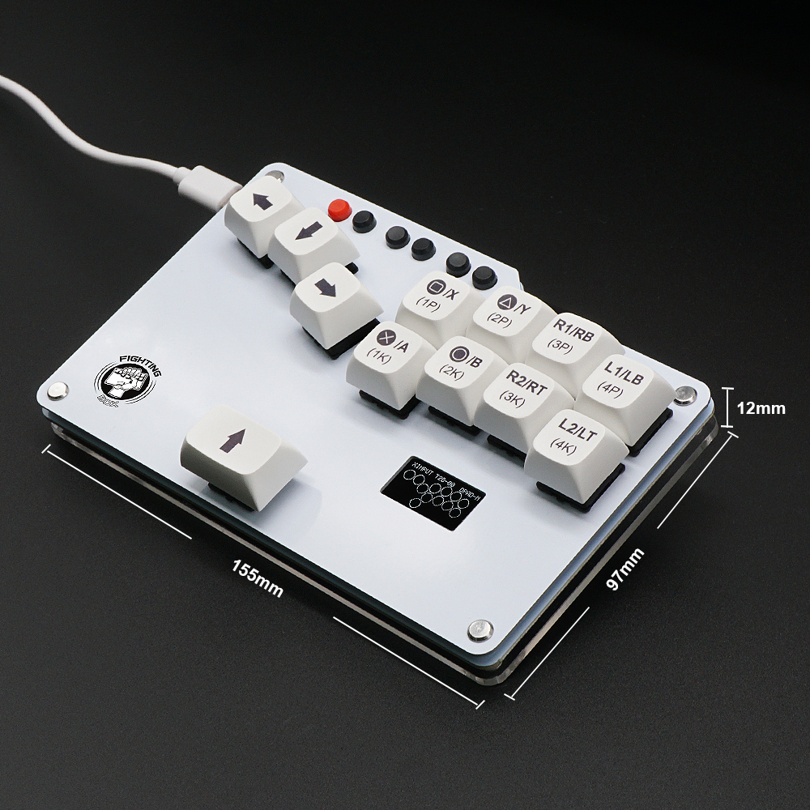
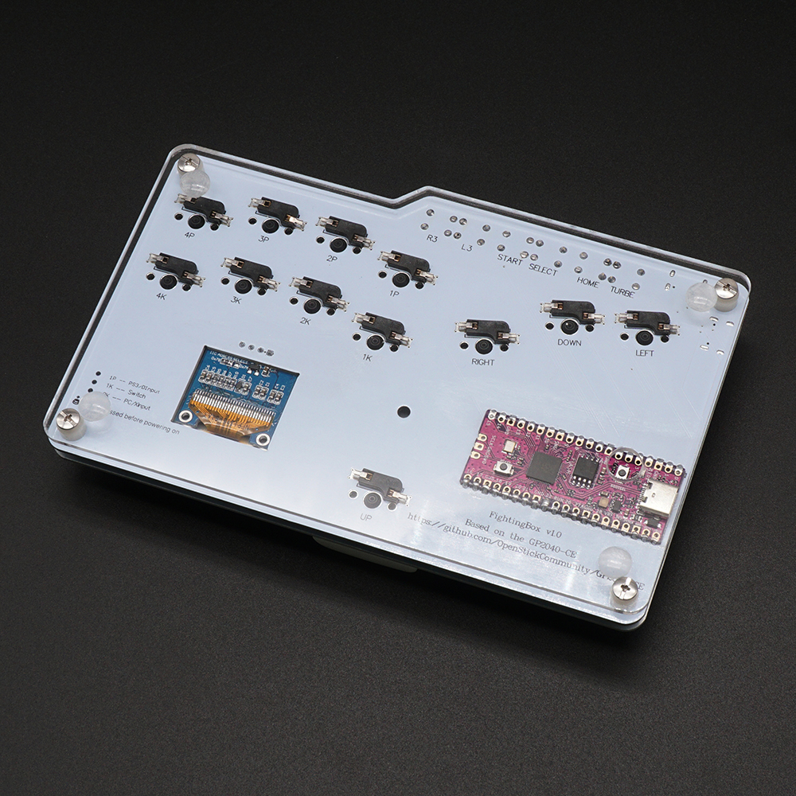
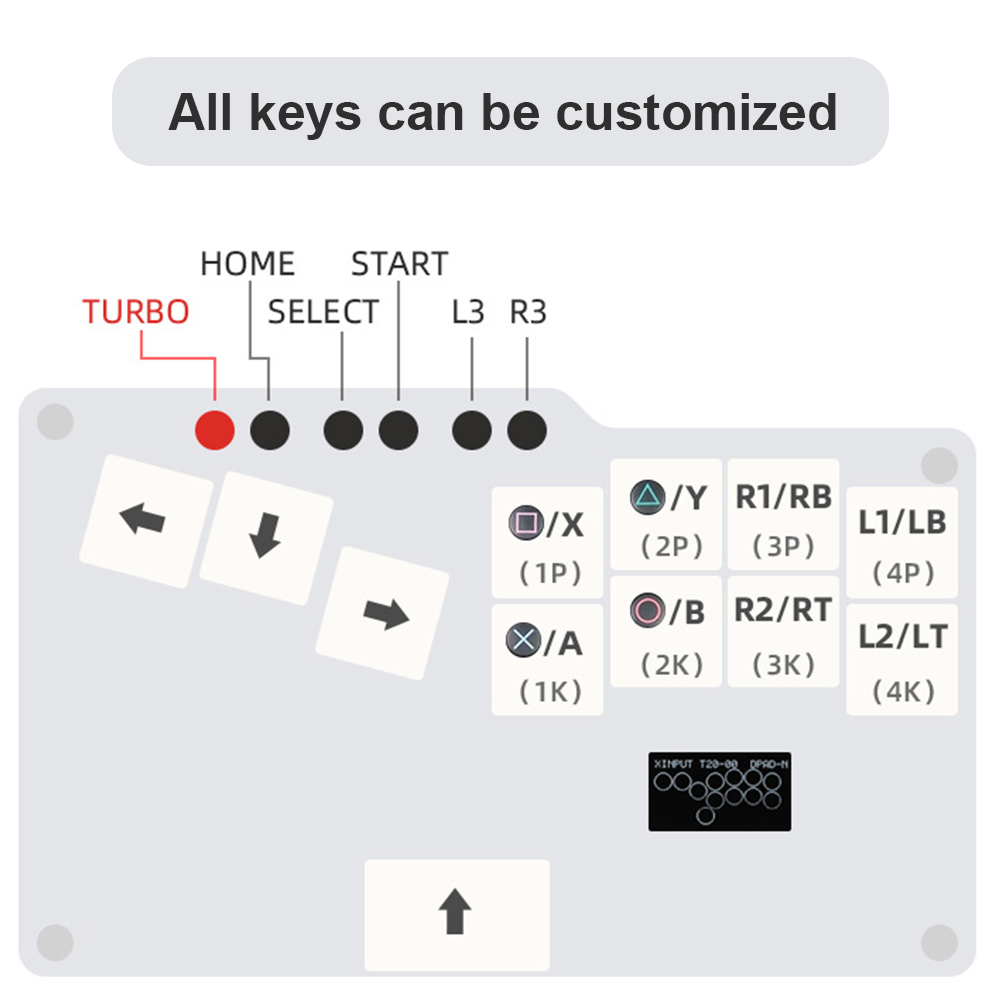
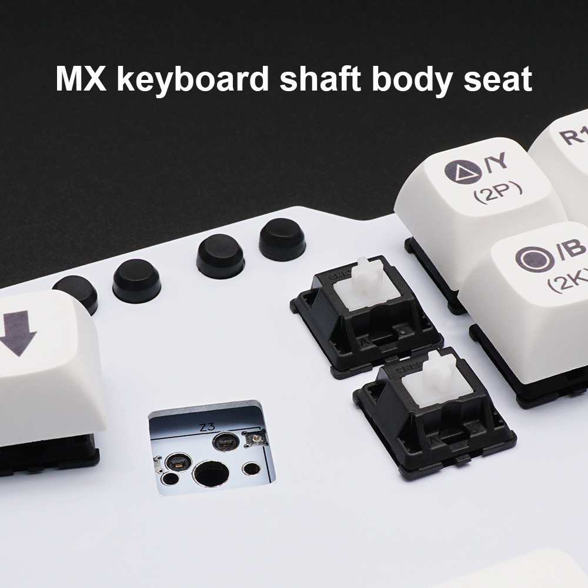
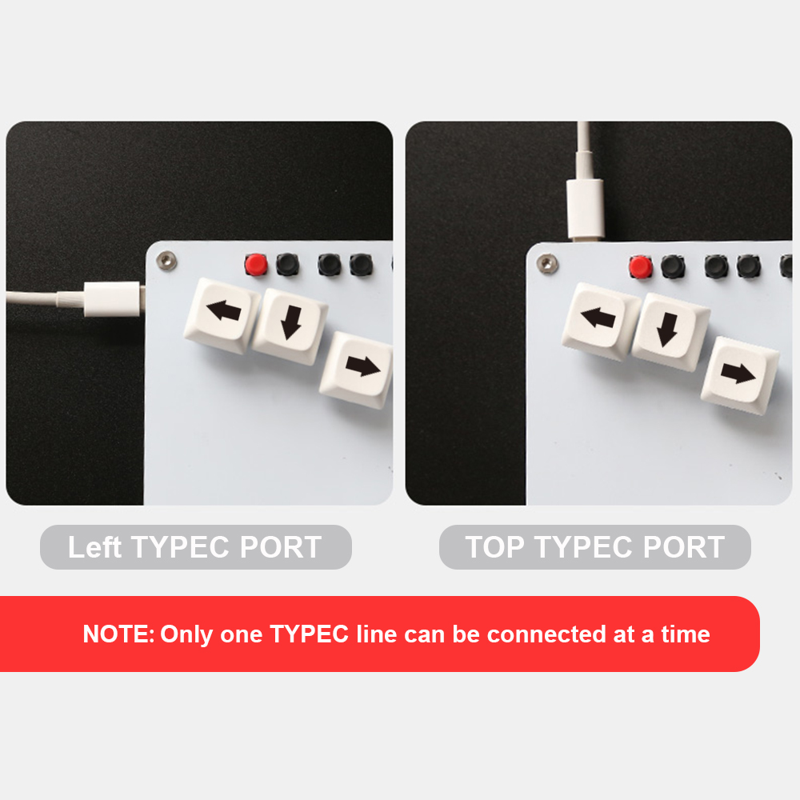
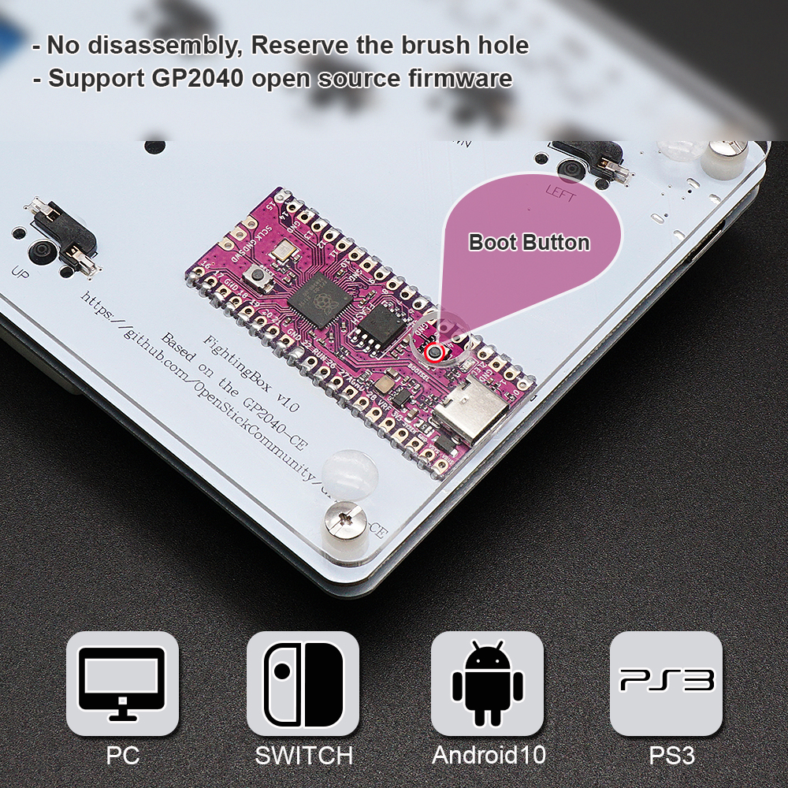
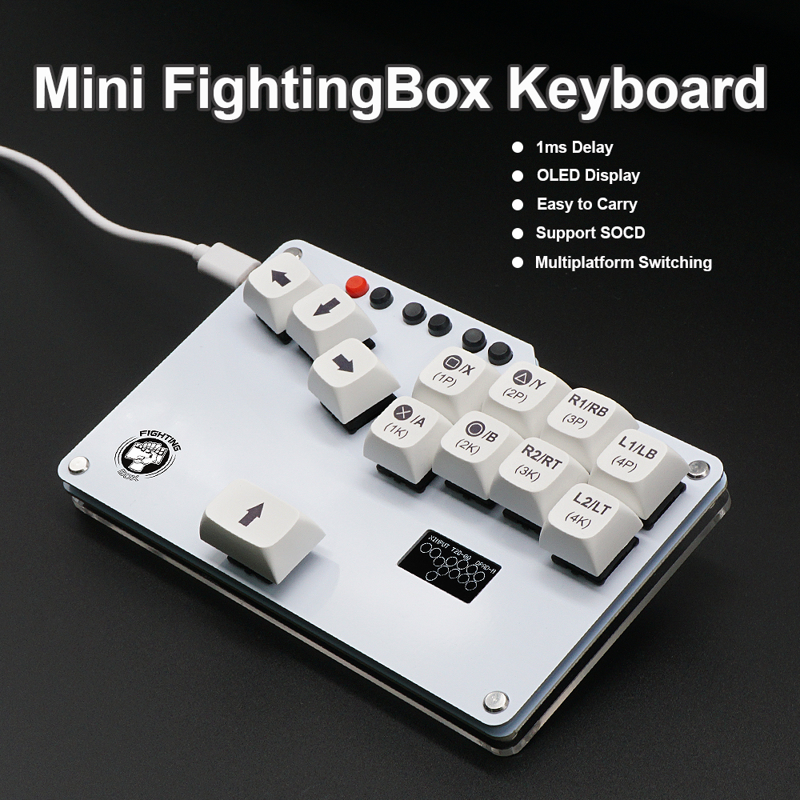

# GP2040-CE Configuration for Bitfunx FightingBox V1.0

A custom GP2040-CE configuration for the **Bitfunx FightingBox V1.0** arcade controller, providing optimal button mapping and enhanced features for fighting games.

 


## 🔧 Technical Specifications

| Component | Details |
|-----------|---------|
| **Microcontroller** | Raspberry Pi Pico (RP2040) |
| **Layout** | Stickless (Hitbox-style) |
| **Display** | I2C OLED 128x64 (SDA: Pin 26, SCL: Pin 27) |
| **I2C Speed** | 400kHz |
| **Splash Duration** | 2.5 seconds |
| **Button Layout** | BUTTON_LAYOUT_STICKLESS |
| **Firmware Base** | GP2040-CE |

## 🚀 Installation

### Prerequisites
- Bitfunx FightingBox V1.0 controller (cheap Aliexpress controller)
- USB cable for firmware flashing
- Computer with web browser (for web-based flashing) or build environment

### Manual Build
```bash
git clone --recursive https://github.com/Thoxy67/GP2040-CE.git
cd GP2040-CE
git submodule update --init --recursive
mkdir build && cd build
cmake -DPICO_BOARD=FightingBoxV1 ..
make -j4
```

## ⚙️ Configuration

The firmware comes pre-configured for optimal FightingBox V1.0 performance. Additional customization can be done through:

- **Web Configurator**: Access at `http://192.168.7.1` while connected
- **Button Remapping**: Use the built-in hotkey combinations
- **Display Settings**: Customize splash screen and layout options
- **Input Modes**: Switch between different console compatibility modes

## 📸 Gallery








## 📄 License

This project is licensed under the MIT License - see the [LICENSE](LICENSE) file for details.

---

**Disclaimer**: This config is provided as-is. Always test thoroughly before use in competitive settings.