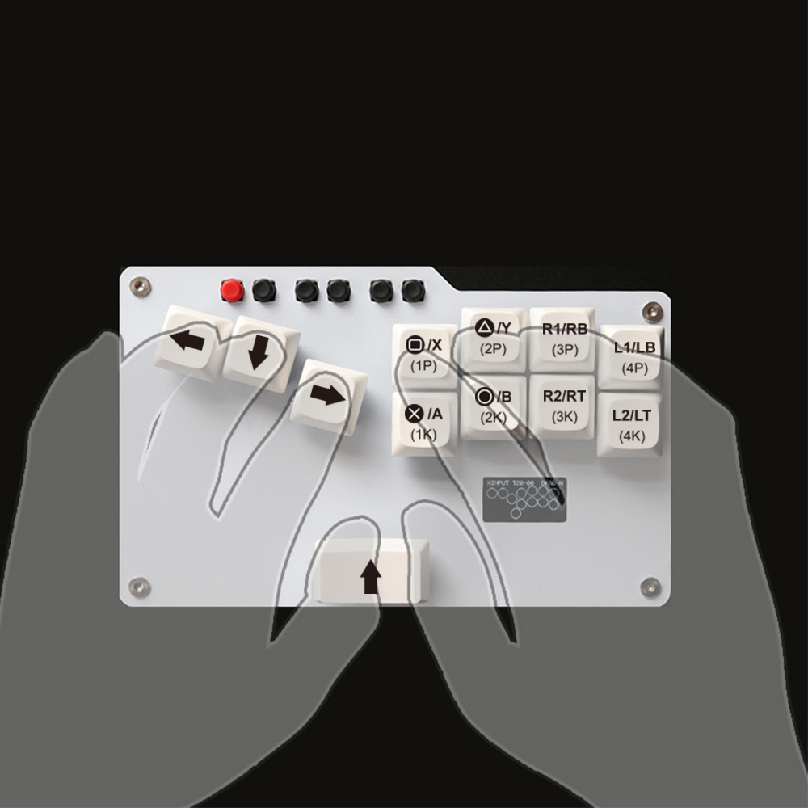

# GP2040-CE Configuration for Bitfunx FightingBox V1.0

A custom GP2040-CE configuration for the **Bitfunx FightingBox V1.0** arcade controller, providing optimal button mapping and enhanced features for fighting games.

 


## 🔧 Technical Specifications

| Component | Details |
|-----------|---------|
| **Microcontroller** | Raspberry Pi Pico (RP2040) |
| **Layout** | Stickless (Hitbox-style) |
| **Display** | I2C OLED 128x64 (SDA: Pin 26, SCL: Pin 27) |
| **I2C Speed** | 400kHz |
| **Splash Duration** | 2.5 seconds |
| **Button Layout** | BUTTON_LAYOUT_STICKLESS |
| **Firmware Base** | GP2040-CE |

## 🚀 Installation

### Option 1: Download Pre-built Firmware (Recommended)

**Download the latest UF2 firmware file from:** https://github.com/Thoxy67/GP2040CE-FightingBoxV1/releases

#### Flashing Instructions

1. **Enter Bootsel Mode**: Hold `UP + Start + Select` (UP + S1 + S2) while connecting the USB cable
2. **Device Recognition**: The controller will appear as a mass storage device named `RPI-RP2`
3. **Flash Firmware**: Copy the downloaded `.uf2` file to the `RPI-RP2` drive
4. **Automatic Reboot**: The device will automatically restart with the new firmware

#### Controller Modes

- **Bootsel Mode**: Hold `UP + Start + Select` (UP + S1 + S2) while connecting USB - for firmware updates
- **Web UI Mode**: Hold `Start + Select` (S1 + S2) while connecting USB - for configuration at `http://192.168.7.1`

### Option 2: Build from Source

#### Prerequisites
- Bitfunx FightingBox V1.0 controller (cheap Aliexpress controller)
- USB cable for firmware flashing
- Computer with web browser (for web-based flashing) or build environment

#### Build Environment Setup

For detailed build environment setup, see: https://gp2040-ce.info/development/build-environment/

**Ubuntu/Debian:**
```bash
sudo apt install cmake gcc-arm-none-eabi libnewlib-arm-none-eabi build-essential libstdc++-arm-none-eabi-newlib nodejs
```

**Arch Linux:**
```bash
sudo pacman -S cmake arm-none-eabi-gcc arm-none-eabi-newlib nodejs
```

#### Build

```bash
make
```

## ⚙️ Configuration

The firmware comes pre-configured for optimal FightingBox V1.0 performance. Additional customization can be done through:

- **Web Configurator**: Access at `http://192.168.7.1` while connected
- **Button Remapping**: Use the built-in hotkey combinations
- **Display Settings**: Customize splash screen and layout options
- **Input Modes**: Switch between different console compatibility modes

## 📸 Gallery





## 🔗 Related Links

- **GP2040-CE Official Website**: https://gp2040-ce.info/
- **GP2040-CE Repository**: https://github.com/OpenStickCommunity/GP2040-CE
- **GP2040-CE Documentation**: https://gp2040-ce.info/introduction/

## 📄 License

This project is licensed under the MIT License - see the [LICENSE](LICENSE) file for details.

---

**Disclaimer**: This config is provided as-is. Always test thoroughly before use in competitive settings.